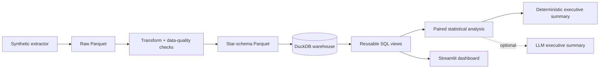
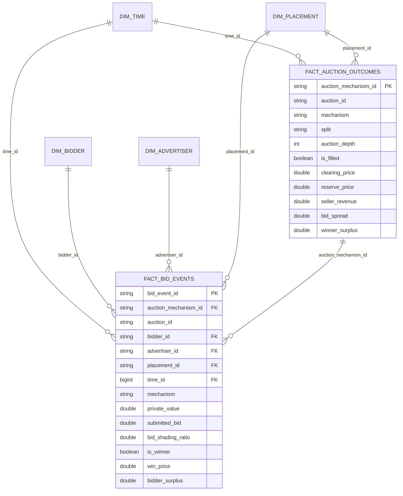

# Ad Auction Mechanism Simulator

A production-style analytics engineering project that simulates real-time bidding auctions, replays the same auction opportunities under multiple mechanisms, warehouses bidder- and auction-level outcomes in DuckDB, and statistically compares revenue, fill rate, bidder surplus, bid spread, auction depth, and bid shading.

The core project is **synthetic-first**: it does not depend on a fragile external download, and it makes every modeling assumption visible and reproducible. An optional iPinYou adapter is included for market-pattern validation, but real campaign-side logs are not misrepresented as a complete view of all competing bidders.

## What the project demonstrates

- Auction-mechanism implementation: first-price, second-price/Vickrey, and a prior-independent single-sample reserve mechanism
- Reproducible synthetic data generation with calibration and held-out evaluation splits
- Modular ETL rather than a notebook-only workflow
- Star-schema modeling in DuckDB
- Reusable SQL views for operational KPIs
- Paired statistical testing across mechanisms on identical auctions
- Streamlit dashboarding
- Optional, clearly labeled LLM-generated executive summary
- Automated tests and GitHub Actions CI

## Business question

A publisher or ad exchange wants to understand how auction design changes economic and operational outcomes:

1. Which mechanism produces the highest seller revenue per auction?
2. What revenue–fill-rate tradeoff is introduced by reserve pricing?
3. How does auction depth affect first-price bid shading?
4. How much surplus remains with the winning bidder?
5. Are observed revenue differences statistically distinguishable on the same auction opportunities?

## Mechanisms

### First-price

The highest eligible bidder wins and pays its submitted bid. The simulator uses the transparent symmetric independent-private-values uniform benchmark, `((n - 1) / n) × value`, as the base shading factor, with a small bidder-specific risk-aversion adjustment.

Because the simulated values are log-normal rather than uniform, this is labeled as a behavioral approximation—not a claimed closed-form equilibrium for the generated distribution.

### Second-price / Vickrey

The highest eligible bidder wins and pays the greater of the placement floor and the second-highest bid. Bidders submit their private values truthfully in the simulation.

### Prior-independent single-sample reserve

The mechanism is not given the true valuation distribution. For each held-out auction, it draws one private-value sample from the calibration split for the same placement and uses the greater of that sample and the placement floor as an anonymous reserve. Allocation and payment then follow second-price rules.

This design makes the “prior-free/prior-independent” claim concrete and testable: the mechanism receives samples, not distribution parameters.

## Experimental design

The simulator first generates a base set of auction opportunities containing:

- timestamp and placement
- auction quality multiplier
- participating bidders
- bidder–advertiser relationship
- private value
- bidder risk-aversion parameter

Each base auction is then replayed under all three mechanisms. Reusing identical private values creates a paired experimental design and reduces comparison noise.

Twenty percent of base auctions are assigned to the calibration split. Only those calibration bids may supply reserves to the sample-reserve mechanism. KPI views and hypothesis tests use the remaining held-out evaluation auctions.

## Architecture



## Warehouse schema



Auction-level revenue is stored separately in `fact_auction_outcomes` so that revenue is not accidentally multiplied by the number of bidders when analysts aggregate `fact_bid_events`.

## KPI definitions

| KPI | Definition |
|---|---|
| Fill rate | Filled auctions ÷ all auctions |
| Revenue per auction | Total seller revenue ÷ all auctions, including unfilled auctions |
| Revenue per filled auction | Total seller revenue ÷ filled auctions |
| Auction depth | Number of participating bidders in an auction |
| Bid spread | Clearing price minus second-highest submitted bid; usually near zero in second-price auctions unless a reserve binds |
| Top-bid gap | Highest submitted bid minus second-highest submitted bid |
| Bid-shading ratio | Submitted bid ÷ private value |
| Winner surplus | Winning bidder’s private value minus clearing price |

## Statistical comparison

Because all mechanisms are evaluated on the same auction IDs, the project uses paired tests:

- paired t-test on revenue differences
- two-sided Wilcoxon signed-rank test as the primary skew-robust test
- paired Cohen’s `dz`
- matched-pairs rank-biserial effect size

The project does **not** use an unpaired Mann–Whitney test for the primary conclusion because that would discard the paired structure of the experiment.

## Reproducible sample result

The tracked sample result uses:

```text
seed = 42
base auctions = 10,000
calibration auctions = 2,001
evaluation auctions = 7,999
raw bidder records = 64,889
bid-event rows across three mechanisms = 194,667
```

| Mechanism | Fill rate | Revenue / auction | Mean shading ratio | Winner surplus |
|---|---:|---:|---:|---:|
| First-price | 99.81% | 4.939 CPM | 82.86% | 0.966 CPM |
| Second-price | 99.99% | 4.231 CPM | 100.00% | 1.679 CPM |
| Sample reserve | 80.70% | 3.756 CPM | 100.00% | 1.413 CPM |

**Finding:** in this controlled seed-42 simulation, first-price auctions generated 16.7% more mean revenue per auction than second-price auctions, while reducing mean winner surplus by 42.4%; the paired Wilcoxon comparison was statistically distinguishable (`p < 1e-250`). The single-sample reserve mechanism traded a lower 80.7% fill rate for higher revenue per filled auction than plain second-price, but lower revenue per available auction.

These numbers are reproducible simulation outputs, not production ad-market benchmarks. Full tables are retained in [`docs/sample_results`](docs/sample_results).

## Repository structure

```text
.
├── dashboard/
│   └── app.py
├── data/
│   ├── raw/
│   ├── staging/
│   └── warehouse/
├── docs/
│   ├── BUILD_PLAN.md
│   └── sample_results/
├── sql/
│   └── views.sql
├── src/ad_auction_simulator/
│   ├── adapters/ipinyou.py
│   ├── pipeline/extract.py
│   ├── pipeline/transform.py
│   ├── pipeline/load.py
│   ├── analysis.py
│   ├── mechanisms.py
│   └── run_pipeline.py
├── tests/
├── .github/workflows/ci.yml
├── Makefile
└── pyproject.toml
```

## Setup

Python 3.11 or newer is required.

```bash
python3 -m venv .venv
source .venv/bin/activate
python -m pip install --upgrade pip
python -m pip install -e ".[dev]"
```

Run a quick reproducible pipeline:

```bash
auction-sim --auctions 10000 --seed 42
```

Run a larger experiment:

```bash
auction-sim --auctions 100000 --bidders 60 --days 60 --seed 42
```

Reuse existing raw Parquet while changing downstream code:

```bash
auction-sim --skip-extract
```

Launch the dashboard:

```bash
streamlit run dashboard/app.py
```

Run tests:

```bash
pytest
```

## SQL views

The load stage creates:

- `v_mechanism_kpis`
- `v_daily_fill_rate`
- `v_bid_shading_by_depth`
- `v_auction_depth_distribution`
- `v_placement_mechanism_kpis`

Example:

```sql
SELECT
    mechanism,
    fill_rate,
    revenue_per_auction,
    avg_shading_ratio,
    avg_winner_surplus
FROM v_mechanism_kpis
ORDER BY revenue_per_auction DESC;
```

## Optional AI summary

The deterministic analysis pipeline always produces `artifacts/executive_summary.md`. An optional OpenAI call can rewrite the same computed statistics into one constrained executive paragraph.

Install the optional dependency:

```bash
python -m pip install -e ".[ai]"
```

Set credentials locally:

```bash
cp .env.example .env
# Add OPENAI_API_KEY and OPENAI_MODEL to .env, then export them in your shell.
```

Run:

```bash
auction-sim --skip-extract --llm-summary
```

The LLM receives aggregated KPI and hypothesis-test JSON only. It does not generate metrics, change calculations, or decide statistical significance. If credentials are absent or the API call fails, the deterministic summary remains the output.

## Real-data extension

### iPinYou

The official contest dataset and benchmark paper remain useful for validating bid-price, pay-price, click, conversion, campaign, and temporal patterns. The included adapter normalizes common fields from an extracted tab-separated log.

However, the public logs are primarily advertiser/campaign-side records and should not automatically be treated as a complete list of every competing bid in each auction. Therefore, this project does not use iPinYou to claim true auction depth or to replay counterfactual first-price and second-price outcomes.

### Criteo

The Criteo Display Advertising Challenge data are designed primarily for click-through-rate prediction. They are useful for response modeling, but they do not replace a complete multi-bid auction log for this mechanism-comparison problem.

## Data-quality checks

The transform stage fails the pipeline when it detects:

- duplicate bid-event IDs
- duplicate auction-mechanism IDs
- nulls in required bidder-level fields
- more than one winner for an auction mechanism
- negative seller revenue
- simulated submitted bids above private value

## Suggested commit sequence

The repository is designed to be built and demonstrated iteratively. A credible sequence is documented in [`docs/BUILD_PLAN.md`](docs/BUILD_PLAN.md); do not manufacture commit dates or claim work that was not performed.

## References

1. William Vickrey, “Counterspeculation, Auctions, and Competitive Sealed Tenders,” *The Journal of Finance*, 1961. https://doi.org/10.1111/j.1540-6261.1961.tb02789.x
2. Roger B. Myerson, “Optimal Auction Design,” *Mathematics of Operations Research*, 1981. https://doi.org/10.1287/moor.6.1.58
3. Hu Fu, Nicole Immorlica, Brendan Lucier, and Philipp Strack, “Randomization Beats Second Price as a Prior-Independent Auction,” 2015. https://arxiv.org/abs/1507.08042
4. Weinan Zhang, Shuai Yuan, Jun Wang, and Xuehua Shen, “Real-Time Bidding Benchmarking with iPinYou Dataset,” 2014. https://arxiv.org/abs/1407.7073
5. iPinYou RTB Dataset portal. https://contest.ipinyou.com/
6. Criteo Display Advertising Challenge. https://ailab.criteo.com/display-advertising-challenge-criteo/
7. DuckDB Python API. https://duckdb.org/docs/stable/clients/python/overview
8. Streamlit documentation. https://docs.streamlit.io/
9. Official OpenAI Python SDK. https://github.com/openai/openai-python
